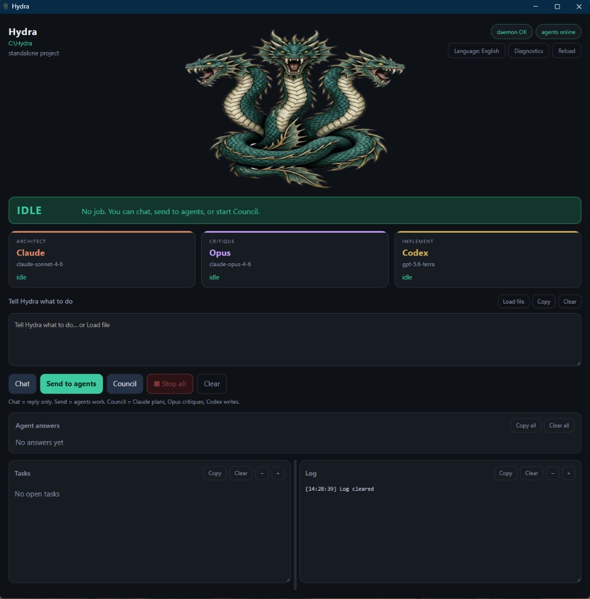

# Hydra

[](https://github.com/timtimeshock/Hydra/actions/workflows/ci.yml)
[](https://opensource.org/licenses/MIT)

**Multi-agent AI orchestrator** for [Claude Code](https://docs.anthropic.com/en/docs/claude-code) and [Codex CLI](https://github.com/openai/codex) (optional [Gemini CLI](https://github.com/google-gemini/gemini-cli)).

> **Status:** Active development. APIs may change between releases.

<p align="center">
  
</p>

Hydra is a **local orchestrator**. It does not replace Claude or Codex — it runs them together through a shared HTTP daemon, task queue, desktop GUI, and multi-round **Council**.

## What Hydra is / is not

| Hydra **is** | Hydra **is not** |
|--------------|------------------|
| A Node.js app you install with `npm install` | A bundle that installs Claude / Codex for you |
| A coordinator (daemon + GUI + operator CLI) | A cloud SaaS or hosted agent |
| Opinionated about **model IDs** in `hydra.config.json` | Interested in *how* you authenticated (Anthropic, Bedrock, ChatGPT, API keys, …) |

If `claude` and `codex` do not already work on your machine, Hydra’s Chat / Send / Council will not work either. That is expected.

## Requirements

| Requirement | Notes |
|-------------|--------|
| **Node.js 20+** | Required to run Hydra |
| **PowerShell 7+** | Windows launchers (Linux/macOS can call Node directly) |
| **`claude` on PATH** | [Claude Code](https://docs.anthropic.com/en/docs/claude-code) must be installed and able to run a prompt. **Opus is not a separate product** — Council critique uses the same `claude` binary with an Opus model id. |
| **`codex` on PATH** | [Codex CLI](https://github.com/openai/codex) must be installed and able to run a prompt. |
| **Gemini CLI** | Optional. Default Council critique uses Opus via `claude`, not Gemini. |
| **`gh` CLI** | Optional, for GitHub features |

Install the agent CLIs yourself (examples):

```bash
npm install -g @anthropic-ai/claude-code
npm install -g @openai/codex
# optional: npm install -g @google/gemini-cli
```

Then verify **outside** Hydra:

```bash
claude -p "ping"
codex --help
```

## Quick start

```bash
git clone https://github.com/timtimeshock/Hydra.git
cd Hydra
npm install
npm run setup          # detect CLIs, register MCP, write default models

# Operator console
node lib/hydra-operator.mjs

# Desktop GUI (Windows / local browser UI)
node lib/hydra-gui.mjs

# Optional: global `hydra` command
pwsh -File .\bin\install-hydra-cli.ps1   # Windows
# npm run install:global
```

Copy `.env.example` → `.env` only if you need API keys for optional features. Prefer CLI logins when possible. **Never commit `.env`.**

In the GUI, use **Diagnostics** to confirm `claude` and `codex` are on PATH. Auth method is not checked on purpose.

### First-run checklist

1. Node 20+  
2. `claude` and `codex` on PATH and working alone  
3. `npm install` + `npm run setup`  
4. GUI **Diagnostics** → Claude / Codex OK  
5. Then Chat / Send to agents / Council  

## Why Hydra?

Each coding agent has strengths. Claude is strong at planning; Opus (same Claude CLI) is strong at critique; Codex is strong at implementation. Hydra runs them as one workflow:

- **Route work** — local heuristic picks agent / tandem / council  
- **Parallel workers** — headless agents claim tasks (often in git worktrees)  
- **Council** — Claude proposes → Opus critiques → Claude refines → Codex implements  
- **Automation** — nightly / evolve pipelines with budgets and recovery  

## Setup (`npm run setup`)

```bash
npm run setup
# or: node lib/hydra-setup.mjs setup
```

This will:

1. Detect `claude` / `codex` / `gemini` on PATH  
2. Register Hydra’s MCP server with installed CLIs (when present)  
3. Ensure default **model slots** in `hydra.config.json` (Claude / Opus / Codex)

It does **not** install vendor CLIs and does **not** log you in.

```bash
hydra init                 # make a project Hydra-aware
hydra setup --uninstall    # remove MCP registration
```

## Architecture

```
                    +-----------+
                    |  Operator |  (interactive REPL)
                    +-----+-----+
                          |
                 +--------+--------+
                 |                 |
           +-----v-----+    +------v----+
           | Concierge |    |  Workers  |
           | (chat AI) |    | (headless)|
           +-----+-----+    +------+----+
                 |                 |
                 +--------+--------+
                          |
                    +-----v-----+
                    |   Daemon  |  (HTTP state + events)
                    +--+--+--+--+
                       |  |  |
          +------------+  |  +-----------+
          v               v              v
     +---------+    +-----------+    +--------+
     | Claude  |    |   Opus    |    | Codex  |
     | Sonnet  |    | (claude)  |    |        |
     +---------+    +-----------+    +--------+
      Architect       Critique       Implement

  Council: Claude → Opus → Claude → Codex
  Concierge: OpenAI → Anthropic → Google fallback (when configured)
```

## Features

### Orchestration & Routing

- **Five orchestration modes**: Auto (3-way routing), Council (multi-round deliberation with structured synthesis), Dispatch (headless pipeline), Smart (auto-tier per complexity), Chat (concierge conversation)
- **Intelligent route classification**: Local heuristic classifies prompts into single/tandem/council routes — zero agent CLI calls for routing
- **Tandem dispatch**: 2-agent lead-follow pairs (e.g., Claude analyzes, Codex implements)
- **Affinity-based task routing**: 10 task types across 3 agents with adaptive learning from outcomes
- **Virtual sub-agents**: Role-specialized agents (security-reviewer, test-writer, doc-generator, researcher) that resolve to physical agents

### Concierge Chat

- **Multi-provider front-end**: Conversational AI (OpenAI → Anthropic → Google fallback) — answers questions directly, escalates to agents when real work is needed
- **Situational awareness**: "What's going on?" fetches real-time activity from daemon and agents
- **Codebase knowledge**: "How does dispatch work?" injects architecture context from docs and knowledge base
- **Command-aware**: Fuzzy matching catches typos before falling back to AI suggestions

### Agent & Model Management

- **Per-agent model switching**: Trade quality for speed/cost at runtime
- **Interactive model picker**: Type-to-filter browser with reasoning effort configuration
- **Headless workers**: Background agent execution with claim-execute-report loop
- **Agent Forge**: Multi-model agent creation pipeline — Gemini analyzes, Claude designs, Gemini critiques, Claude refines, optional live test

### Monitoring & Safety

- **Token usage monitoring**: Three-tier budget tracking (weekly, daily, sliding window) with auto model-switching at critical levels
- **Model recovery**: Automatic fallback when a model is unavailable or rate-limited
- **Rate limit resilience**: Exponential backoff with jitter across all providers
- **Failure doctor**: Diagnoses pipeline failures, detects recurring patterns, auto-creates follow-up tasks
- **Circuit breaker**: Per-model failure tracking with automatic recovery after cool-down
- **5-line status bar**: Persistent terminal footer with agent activity, token gauge, and event ticker

### Automation Pipelines

- **Nightly runner**: Scans TODO comments, `docs/TODO.md`, and GitHub issues → prioritizes → executes autonomously with budget tracking
- **Evolve**: 7-phase autonomous self-improvement with investigator self-healing and knowledge accumulation
- **Tasks runner**: Per-task branch isolation, council-lite review for complex tasks, JSON + Markdown reports
- **AI discovery**: Agent analyzes codebase and suggests improvement tasks
- **Commit attribution**: Automated commits include `Originated-By:` and `Executed-By:` git trailers

### Platform & Infrastructure

- **Event-sourced daemon**: HTTP state management with replay, snapshots, and dead-letter queue
- **Git worktree isolation**: Per-task isolated filesystems for parallel agent work
- **MCP server**: 11 tools, 5 resources, 3 prompts via official SDK (protocol 2025-03-26)
- **Streaming middleware**: Composable pipeline — rate limiting, circuit breaking, retry, telemetry
- **OTel tracing**: Optional distributed tracing with GenAI semantic conventions
- **Heartbeat crash recovery**: Daemon detects stale workers and requeues or dead-letters tasks

## Commands

| Command | Description |
|---------|-------------|
| `npm start` | Start the daemon |
| `npm run go` | Launch operator console |
| `npm run council` | Full council deliberation with structured synthesis |
| `npm run evolve` | Run autonomous self-improvement |
| `npm run nightly` | Run nightly task automation |
| `npm run tasks` | Scan & execute TODO/FIXME/issues |
| `npm run audit` | Multi-agent code audit |
| `npm run eval` | Routing evaluation against golden corpus |
| `npm test` | Run all tests |
| `npm run usage` | Check token usage |
| `npm run models:select` | Interactive model + effort picker |
| `npm run build:exe` | Build standalone Windows executable |

<details>
<summary><strong>All operator commands</strong> (inside the interactive console)</summary>

| Command | Description |
|---------|-------------|
| `:help` | Show help |
| `:status` | Dashboard with agents & tasks |
| `:sitrep` | AI-narrated situation report |
| `:mode auto` | Mini-round triage then delegate/escalate |
| `:mode smart` | Auto-select model tier per prompt complexity |
| `:mode handoff` | Direct handoffs (fast, no triage) |
| `:mode council` | Full council deliberation |
| `:mode dispatch` | Headless pipeline (Claude→Gemini→Codex) |
| `:mode [economy\|balanced\|performance]` | Show or set routing mode. Economy boosts local LLM for impl/testing; performance favors cloud. |
| `:model` | Show mode & active models |
| `:model claude=sonnet` | Override agent model |
| `:model reset` | Clear all overrides |
| `:model:select` | Interactive model picker |
| `:roles` | Show role→agent→model mapping & recommendations |
| `:roster` | Edit role→agent→model assignments interactively |
| `:persona` | Edit personality settings interactively |
| `:persona show` | Show current personality config |
| `:persona <preset>` | Apply preset (default/professional/casual/analytical/terse) |
| `:usage` | Token usage & contingencies |
| `:stats` | Agent metrics & performance |
| `:resume` | Scan all resumable state (daemon, evolve, branches, suggestions) |
| `:pause [reason]` | Pause the active session |
| `:unpause` | Resume a paused session |
| `:fork` | Fork current session |
| `:spawn <focus>` | Spawn child session |
| `:tasks` | List active daemon tasks |
| `:tasks scan` | Scan codebase for TODO/FIXME/issues |
| `:tasks run` | Launch autonomous tasks runner |
| `:tasks review` | Interactive branch review & merge |
| `:tasks status` | Show latest tasks run report |
| `:tasks clean` | Delete all tasks/* branches |
| `:handoffs` | List pending & recent handoffs |
| `:cancel <id>` | Cancel a task |
| `:clear` | Interactive menu to select clear target |
| `:clear all` | Cancel all tasks & ack all handoffs |
| `:clear concierge` | Clear conversation history |
| `:clear metrics` | Reset session metrics |
| `:clear screen` | Clear terminal |
| `:archive` | Archive completed work & trim events |
| `:events` | Show recent event log |
| `:workers` | Show worker status |
| `:workers start [agent]` | Start worker(s) |
| `:workers stop [agent]` | Stop worker(s) |
| `:workers restart` | Restart all workers |
| `:workers mode <mode>` | Change permission mode |
| `:watch <agent>` | Open visible terminal for agent |
| `:chat` | Toggle concierge on/off |
| `:chat model` | Show active model & fallback chain |
| `:chat model <name>` | Switch model (e.g. sonnet, flash) |
| `:chat export` | Export conversation to file |
| `:evolve` | Launch evolve session |
| `:evolve status` | Show latest evolve report |
| `:evolve resume` | Resume interrupted session |
| `:evolve knowledge` | Browse knowledge base |
| `:nightly` | Launch nightly run (interactive setup + task selection) |
| `:nightly dry-run` | Scan & prioritize without executing |
| `:nightly review` | Interactive branch review & merge |
| `:nightly status` | Show latest nightly run report |
| `:nightly clean` | Delete all nightly/* branches |
| `:github` | GitHub status |
| `:github prs` | List open pull requests |
| `:pr create [branch]` | Push branch & create PR |
| `:pr list` | List open pull requests |
| `:pr view <number>` | Show PR details |
| `:forge` | Interactive agent creation wizard |
| `:forge list` | List forged agents |
| `:forge delete <name>` | Remove a forged agent |
| `:agents` | List all registered agents |
| `:agents add` | Register a new custom CLI or API agent |
| `:agents remove <name>` | Remove a custom agent from config |
| `:agents test <name>` | Send a test prompt to verify agent works |
| `:agents info <name>` | Show agent details & config |
| `:doctor` | Diagnostic stats & recent log entries |
| `:doctor log` | Show last 25 diagnostic entries |
| `:doctor fix` | Auto-detect and fix issues via action pipeline |
| `:doctor diagnose <text>` | Investigate a failure via GPT-5.3 |
| `:kb` | Knowledge base stats & recent entries |
| `:kb <query>` | Search knowledge base entries |
| `:cleanup` | Scan & clean stale branches, tasks, artifacts |
| `:sync` | Sync HYDRA.md to agent instruction files |
| `:confirm` | Show/toggle dispatch confirmations |
| `:dry-run` | Toggle dry-run mode (preview dispatches without executing) |
| `:shutdown` | Stop the daemon |
| `:quit` | Exit operator console |
| `!<prompt>` | Force dispatch (bypass concierge) |

</details>

## Configuration

Hydra is configured via `hydra.config.json` in the project root. Key sections:

| Section | Controls |
|---------|----------|
| `roles` | Role→agent→model mapping (architect, analyst, implementer, etc.) |
| `models` | Active model per agent + overrides |
| `routing` | Route strategy, council gate, tandem dispatch |
| `workers` | Headless worker settings, permission modes, heartbeat |
| `nightly` | Nightly pipeline sources, budget, AI discovery |
| `evolve` | Self-improvement rounds, suggestions backlog |
| `doctor` | Failure diagnosis, recurring pattern detection |
| `github` | PR defaults, labels, reviewers |
| `providers` | API keys, tier levels, rate limits |
| `persona` | Concierge personality, tone, presets |

See [docs/USAGE.md](docs/USAGE.md) for full configuration reference.

## Daemon security

The HTTP daemon binds to `127.0.0.1` (localhost only) by default. It is designed for local, single-user use and does not include authentication. See [SECURITY.md](SECURITY.md) for vulnerability reporting.

## Documentation

- [Installation Guide](docs/INSTALL.md)
- [Usage & Commands](docs/USAGE.md)
- [Architecture](docs/ARCHITECTURE.md)
- [Changelog](CHANGELOG.md)
- [Contributing](CONTRIBUTING.md)
- [Security](SECURITY.md)

## License

[MIT](LICENSE) — original copyright retained in `LICENSE`.
